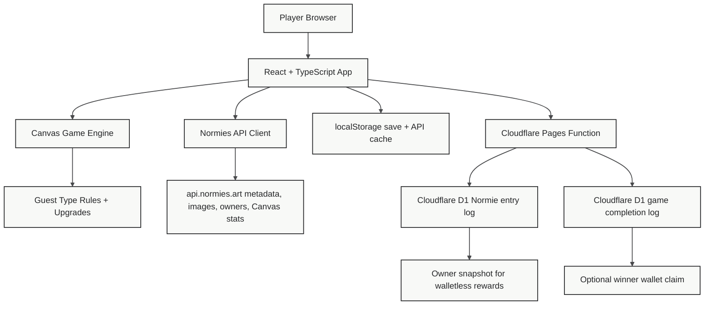
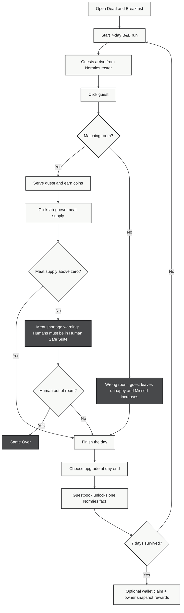

# Dead and Breakfast

---> [Play the live demo](https://dead-and-breakfast.pages.dev)

You run a seaside hotel where every weary Normie visitor deserves prompt hospitality! Keep the Humans safe, serve Zombies lab-grown human meat, honor Alien tech, rush check-ins for Agents, and keep Cats happy with ocean-scrap chow, before the week gets out of hand! You have 7 game-days to survive Dead and Breakfast. NO WALLET CONNECT! Enter any Normie # and that owner receives on-chain rewards. Created by bitpixi - Normie #2613

## Highlights

- Walletless by design: no wallet connect is required to play, while entered Normie IDs still log the current owner snapshot for rewards.
- Deep Normies API use: live metadata, Type traits, token images, owner lookups, Canvas stats, and fallback guests all shape the game loop.
- Type-driven gameplay: Humans, Zombies, Cats, Aliens, and Agents each have matching rooms, service rules, bonuses, and penalties.
- Complete 7-day arcade loop: patience timers, lab-grown meat pressure, wrong-room misses, coins, upgrades, local saves, and an optional winner wallet claim.
- Guestbook lore promotes Normies facts without extra API polling, revealing one signed entry after each survived day.
- Monochrome pixel art, horror-comedy theming, and low-friction browser play match the Normies on-chain bitmap spirit.

## Guestbook

Dead and Breakfast includes a seven-entry Guestbook that unlocks one note after each survived day. The entries are playful in-world blurbs from Normies visitors, but each one promotes a real Normies API or Canvas fact: burned Normies, live Zombie counts, Canvas transforms, burn commitments, action points, and walletless reward tracking.

Example:

> I heard as of June 30, 2026, 2,603 Normies had been burned. That stressed me out, so I checked into D&B for a quiet breakfast.
>
> - Normie #5652

The game uses already-loaded Canvas stats when available and falls back to a verified snapshot, so the Guestbook adds Normies flavor without repeatedly calling the API.

## In Progress

## Gameplay

1. Start the first day.
2. Click a waiting guest.
3. Click the matching room or station before their patience runs out.
4. Click rapidly to produce lab-grown meat.
4. Earn coins for good service that you can use to purchase upgrades. 

## Normies API Use

- Loads starter guests from verified Normie token IDs.
- Fetches `/normie/{tokenId}/metadata` for live trait data.
- Uses `/normie/{tokenId}/image.svg` for guest portraits.
- Reads Type, Level, Action Points, and Customized traits.
- Fetches Canvas history stats when available and reuses them for Guestbook lore.
- Caches API responses locally and preserves a tested fallback path.

## Technical Architecture

## User Flow

## Tech Stack

- React 19 + TypeScript + Vite
- Codex-assisted build
- Canvas-rendered game stage
- Normies API client
- LocalStorage save system
- Vitest coverage for game rules, engine behavior, API normalization, and save migration
- Cloudflare Pages deployment

## Demo

Play it here: [dead-and-breakfast.pages.dev](https://dead-and-breakfast.pages.dev)
