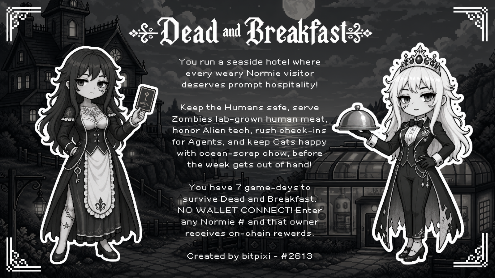
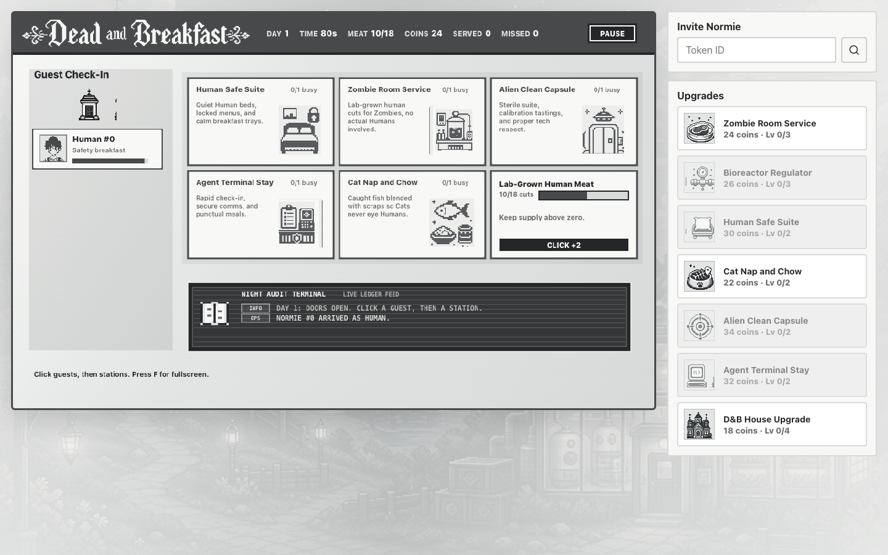
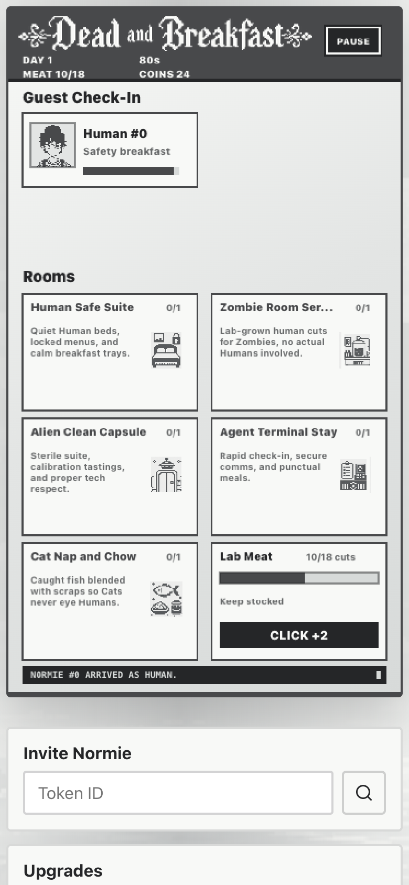

# Dead and Breakfast

**A walletless Normies API time-management game for the Normies Hackathon.**

[Play the live demo](https://dead-and-breakfast.pages.dev) · [Normies API](https://api.normies.art)

Dead and Breakfast is a monochrome hotel-management game where each Normies Type needs a different kind of hospitality. Players run a bed-and-breakfast that must feed Zombies without endangering Humans, give Cats fishy scraps before they eye the guests, keep Aliens in sterile clean rooms, and process Agents through a secure terminal stay.

## Highlights

- Normies didn't want to connect wallets to hackathon sites, so we took a unique approach.
- Normies token metadata and images are served from `api.normies.art`, also with manual entries that store that owner to send on-chain rewards.
- Uses Normies Type traits as rules: Human, Zombie, Cat, Alien, and Agent each route differently.
- Includes a complete 7 game days with patience timers, service stations, coins, misses, upgrades, and local save persistence.
- Monochrome art direction to match Normies.

## Gameplay

1. Start the first day.
2. Click a waiting guest.
3. Click the matching room or station before their patience runs out.
4. Click rapidly to produce lab-grown meat.
4. Earn coins for good service that you can use to purchase upgrades. 

## In Progress

| Desktop | Mobile |
| --- | --- |
|  |  |

## Normies API Use

- Loads starter guests from verified Normie token IDs.
- Fetches `/normie/{tokenId}/metadata` for live trait data.
- Uses `/normie/{tokenId}/image.svg` for guest portraits.
- Reads Type, Level, Action Points, and Customized traits.
- Fetches Canvas history stats when available.
- Caches API responses locally and preserves a tested fallback path.

## Tech Stack

- React 19 + TypeScript + Vite
- Codex (Melbourne ambassador)
- Canvas-rendered game stage
- Normies API client
- LocalStorage save system
- Vitest coverage for game rules, engine behavior, API normalization, and save migration
- Cloudflare Pages deployment

## Demo

Play it here: [dead-and-breakfast.pages.dev](https://dead-and-breakfast.pages.dev)
