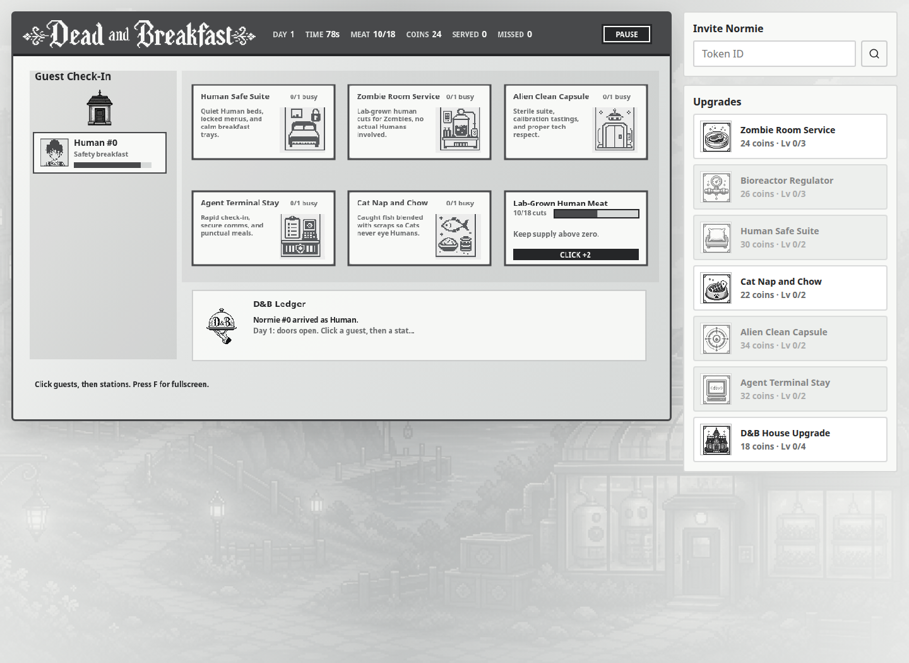

# Dead and Breakfast

**A walletless Normies API time-management game for the Normies Hackathon.**

[Play the live demo](https://dead-and-breakfast.pages.dev) · [Normies API](https://api.normies.art)

Dead and Breakfast is a monochrome hotel-management game where each Normies Type needs a different kind of hospitality. Players run a bed-and-breakfast that must feed Zombies without endangering Humans, give Cats fishy scraps before they eye the guests, keep Aliens in sterile clean rooms, and process Agents through a secure terminal stay.

The hackathon prompt is simple: use the Normies API and build the best tool, game, or app around it. This entry leans into "game": a complete playable loop, live token lookup, persistent progress, Type-specific mechanics, and a clear Normies-native premise.

## Judge Highlights

- Uses live Normies token metadata and images from `api.normies.art`.
- Lets judges invite any Normie by token ID, then turns that token's Type into gameplay behavior.
- Uses Normies Type traits as rules: Human, Zombie, Cat, Alien, Agent, and Unknown each route differently.
- Includes a complete day loop with patience timers, service stations, coins, misses, upgrades, and local save persistence.
- Falls back gracefully to a demo roster when the API is unavailable, so the game remains judgeable.
- Custom monochrome art direction, canvas-rendered playfield, generated room/upgrades sprites, and matching favicon/logo assets.

Players run a monochrome bed-and-breakfast for Normies:

- Zombies get lab-grown human meat so Humans stay safe.
- Humans get calm rooms and safety-first breakfast service.
- Aliens are VIPs whose successful service calibrates the bioreactor.
- Agents are VIPs whose successful service speeds operations.
- Cats get ocean fish blended with kitchen scraps.

## Gameplay

1. Start the day.
2. Click a waiting guest.
3. Click the matching room or station before their patience runs out.
4. Earn coins and reputation for good service.
5. Buy upgrades between runs to expand the house, speed service, and stabilize the bioreactor.

The core joke is also the core mechanic: a Zombie is not a bad guest, but serving them like a Human is catastrophically poor hospitality.

## In Progress

| Desktop | Mobile |
| --- | --- |
|  |  |

## Normies API Use

- Loads starter guests from verified Normie token IDs.
- Fetches `/normie/{tokenId}/metadata` for live trait data.
- Uses `/normie/{tokenId}/image.svg` for guest portraits.
- Reads Type, Level, Action Points, and Customized traits.
- Fetches Canvas history stats when available.
- Caches API responses locally and preserves a tested fallback path.

## Tech Stack

- React 19 + TypeScript + Vite
- Canvas-rendered game stage
- Normies API client with cache and fallback data
- LocalStorage save system
- Vitest coverage for game rules, engine behavior, API normalization, and save migration
- Cloudflare Pages deployment

## Demo

Play it here: [dead-and-breakfast.pages.dev](https://dead-and-breakfast.pages.dev)

The app uses the live Normies API when available and falls back to a demo roster when the API is unavailable.
